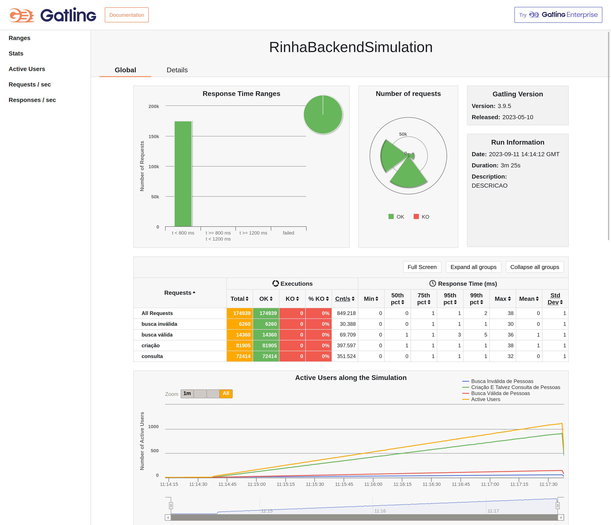
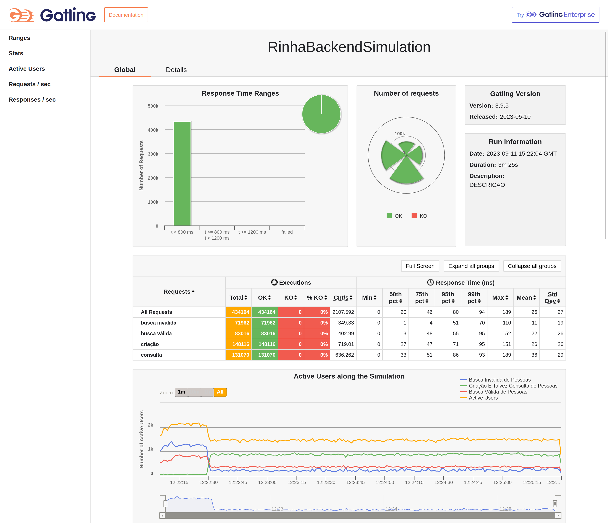

# rinha de backend

A implementation for the challenge [rinha de backend](https://github.com/zanfranceschi/rinha-de-backend-2023-q3), inspired(parts of it are copy pasted) from [rinha-backend-rust](https://github.com/viniciusfonseca/rinha-backend-rust)

For Manjaro I had to make some changes to my kernel configuration to be able to properly execute the stress test without suffering `J.I.IOException: Premature Close` errors, this was my `/etc/sysctl.conf` I've found some interesting insights at https://nateware.com/2013/04/06/linux-network-tuning-for-2013/#.VnQ7hXOnzbt:
```conf
# Increase system file descriptor limit
fs.file-max = 9223372036854775807

# Discourage Linux from swapping idle processes to disk (default = 60)
vm.swappiness = 10

# Increase ephermeral IP ports
net.ipv4.ip_local_port_range = 10000 65000

# Increase Linux autotuning TCP buffer limits
# Set max to 16MB for 1GE and 32M (33554432) or 54M (56623104) for 10GE
# Don't set tcp_mem itself! Let the kernel scale it based on RAM.
net.core.rmem_max = 16777216
net.core.wmem_max = 16777216
net.core.rmem_default = 16777216
net.core.wmem_default = 16777216
net.core.optmem_max = 40960
net.ipv4.tcp_rmem = 4096 87380 16777216
net.ipv4.tcp_wmem = 4096 65536 16777216

# Make room for more TIME_WAIT sockets due to more clients,
# and allow them to be reused if we run out of sockets
# Also increase the max packet backlog
net.core.netdev_max_backlog = 100000
net.ipv4.tcp_max_syn_backlog = 30000
net.ipv4.tcp_max_tw_buckets = 2000000
net.ipv4.tcp_tw_reuse = 1
net.ipv4.tcp_fin_timeout = 10

# Disable TCP slow start on idle connections
net.ipv4.tcp_slow_start_after_idle = 0

# If your servers talk UDP, also up these limits
net.ipv4.udp_rmem_min = 8192
net.ipv4.udp_wmem_min = 8192

# Disable source routing and redirects
net.ipv4.conf.all.send_redirects = 0
net.ipv4.conf.all.accept_redirects = 0
net.ipv4.conf.all.accept_source_route = 0
net.ipv6.conf.all.accept_redirects = 0
net.ipv6.conf.all.accept_source_route = 0

# Log packets with impossible addresses for security
net.ipv4.conf.all.log_martians = 1
```

I've also made some changes to my Docker daemon configuration to allow the usage of `ipv6` into it:

```json
{
  "ipv6": true,
  "fixed-cidr-v6": "2001:db8:1::/64",
  "experimental": true,
  "ip6tables": true,
  "default-address-pools": [
    { "base": "172.17.0.0/16", "size": 16 },
    { "base": "172.18.0.0/16", "size": 16 },
    { "base": "172.19.0.0/16", "size": 16 },
    { "base": "172.20.0.0/14", "size": 16 },
    { "base": "172.24.0.0/14", "size": 16 },
    { "base": "172.28.0.0/14", "size": 16 },
    { "base": "192.168.0.0/16", "size": 20 },
    { "base": "2001:db8::/104", "size": 112 }
  ]
}
```
My machine configuration is a Ryzen 7 32gb ddr4 and NVME 7000r/6000w mb/s.

I've added some environment configuration variables to more easily allow changes into the application:
```.env
# LOGGER_OUTPUT describes the output location for the traces from the application the available values are
# 'stdout', 'otel'(it outputs the trace to open telemetry and stdout), 'none'  default is 'none'
LOGGER_OUTPUT=stdout
# Maximum amount of connections at the Database Pool default is '256'
DATABASE_POOL_MAX_SIZE=1024
# Maximum amount of pessoas to be inserted in the batch insertion logic default is '256'
BATCH_MAX_INSERT_SIZE=2048
# Maximum amount of time to wait for new pessoas on the channel for the batch insertion default is '1'
BATCH_MAX_WAIT_ON_INSERT_CHANNEL=2
```

### Current local Results
 - Without Tracing and Search Cache without Expiration time: 46576
 
 - Without Tracing and Search Cache with Expiration time of 15s: 46576
 
 - With StdOut Tracing and Search Cache with Expiration time of 15s: 46576
 
 - With Open Telemetry Tracing and Search Cache with Expiration time of 15s: 46576
 
 - Winner from the challenge: 47089 this value is slightly wrong sine the total amount of requests for insertion is 46576
 


### Current results with some modfiications to the stress test

```scala
    setUp(
        criacaoEConsultaPessoas.inject(
            constantUsersPerSec(2).during(10.seconds), // warm up
            constantUsersPerSec(5).during(15.seconds), // are you ready?
            
            rampUsersPerSec(9).to(900).during(3.minutes) // lezzz go!!!
        ),
        buscaPessoas.inject(
            constantUsersPerSec(2).during(25.seconds), // warm up
            
            rampUsersPerSec(9).to(150).during(3.minutes) // lezzz go!!!
        ),
        buscaInvalidaPessoas.inject(
            constantUsersPerSec(2).during(25.seconds), // warm up
            
            rampUsersPerSec(9).to(60).during(3.minutes) // lezzz go!!!
        )
    ).protocols(httpProtocol)
```

Stress test output:
```bash
================================================================================
---- Global Information --------------------------------------------------------
> request count                                     174939 (OK=174939 KO=0     )
> min response time                                      0 (OK=0      KO=-     )
> max response time                                     51 (OK=51     KO=-     )
> mean response time                                     1 (OK=1      KO=-     )
> std deviation                                          1 (OK=1      KO=-     )
> response time 50th percentile                          0 (OK=0      KO=-     )
> response time 75th percentile                          1 (OK=1      KO=-     )
> response time 95th percentile                          1 (OK=1      KO=-     )
> response time 99th percentile                          3 (OK=3      KO=-     )
> mean requests/sec                                849.218 (OK=849.218 KO=-     )
---- Response Time Distribution ------------------------------------------------
> t < 800 ms                                        174939 (100%)
> 800 ms <= t < 1200 ms                                  0 (  0%)
> t >= 1200 ms                                           0 (  0%)
> failed                                                 0 (  0%)
================================================================================

Reports generated in 0s.
Please open the following file: file:///home/jordao/Documents/rinha-de-backend-2023-q3/stress-test/user-files/results/rinhabackendsimulation-20230911153552766/index.html
* processing: http://localhost:9999/contagem-pessoas
*   Trying [::1]:9999...
* Connected to localhost (::1) port 9999
> GET /contagem-pessoas HTTP/1.1
> Host: localhost:9999
> User-Agent: curl/8.2.1
> Accept: */*
> 
< HTTP/1.1 200 OK
< Server: nginx/1.25.2
< Date: Mon, 11 Sep 2023 15:39:24 GMT
< Content-Type: application/json
< Content-Length: 5
< Connection: keep-alive
< vary: Origin, Access-Control-Request-Method, Access-Control-Request-Headers
< access-control-expose-headers: content-type
< access-control-allow-credentials: true
< 
* Connection #0 to host localhost left intact
69445%  
```



### Current results with usage of constantConcurrentUsers instead of rampUsersPerSecs on the stress test

This was copied from https://github.com/johnaohara/rinha-de-backend-2023-q3/commit/189a68a4d02a1cf2a89a92a582b72f68fb2c17d3

```scala
    setUp(
        criacaoEConsultaPessoas.inject(
            constantConcurrentUsers(2).during(25.seconds), // warm up

            constantConcurrentUsers(60).during(3.minutes) // lezzz go!!!
        ),
        buscaPessoas.inject(
            constantConcurrentUsers(2).during(25.seconds), // warm up

            constantConcurrentUsers(10).during(3.minutes) // lezzz go!!!
        ),
        buscaInvalidaPessoas.inject(
            constantConcurrentUsers(2).during(25.seconds), // warm up

            constantConcurrentUsers(4).during(3.minutes) // lezzz go!!!
        )
    ).protocols(httpProtocol)
```

Stress test ouput:

```bash
================================================================================
---- Global Information --------------------------------------------------------
> request count                                     434164 (OK=434164 KO=0     )
> min response time                                      0 (OK=0      KO=-     )
> max response time                                    189 (OK=189    KO=-     )
> mean response time                                    26 (OK=26     KO=-     )
> std deviation                                         27 (OK=27     KO=-     )
> response time 50th percentile                         20 (OK=20     KO=-     )
> response time 75th percentile                         46 (OK=46     KO=-     )
> response time 95th percentile                         80 (OK=80     KO=-     )
> response time 99th percentile                         94 (OK=94     KO=-     )
> mean requests/sec                                2107.592 (OK=2107.592 KO=-     )
---- Response Time Distribution ------------------------------------------------
> t < 800 ms                                        434164 (100%)
> 800 ms <= t < 1200 ms                                  0 (  0%)
> t >= 1200 ms                                           0 (  0%)
> failed                                                 0 (  0%)
================================================================================

Reports generated in 0s.
Please open the following file: file:///home/jordao/Documents/rinha-de-backend-2023-q3/stress-test/user-files/results/rinhabackendsimulation-20230911152203798/index.html
* processing: http://localhost:9999/contagem-pessoas
*   Trying [::1]:9999...
* Connected to localhost (::1) port 9999
> GET /contagem-pessoas HTTP/1.1
> Host: localhost:9999
> User-Agent: curl/8.2.1
> Accept: */*
> 
< HTTP/1.1 200 OK
< Server: nginx/1.25.2
< Date: Mon, 11 Sep 2023 15:25:37 GMT
< Content-Type: application/json
< Content-Length: 5
< Connection: keep-alive
< vary: Origin, Access-Control-Request-Method, Access-Control-Request-Headers
< access-control-allow-credentials: true
< access-control-expose-headers: content-type
< 
* Connection #0 to host localhost left intact
84671%     
```
