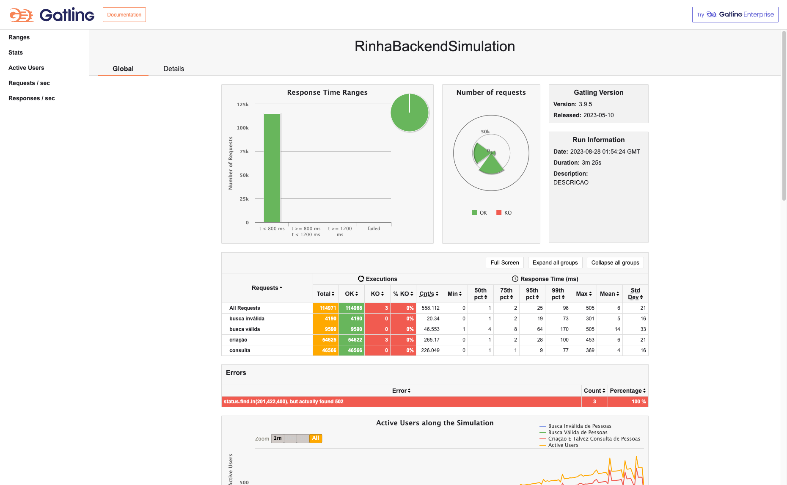
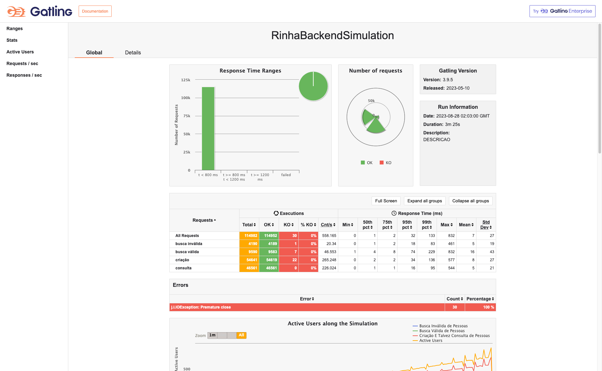

# rinha de backend

A implementation for the challenge [rinha de backend](https://github.com/zanfranceschi/rinha-de-backend-2023-q3), inspired(parts of it are copy pasted) from [rinha-backend-rust](https://github.com/viniciusfonseca/rinha-backend-rust)

### Current local Results for my Macbook M1 16gb
 - Without Cors and Tracing: 46563
 
 - With Cors and Tracing: 46561
 
